# Quantum FoodChain - Blockchain-Based Food Supply Chain

A decentralized end-to-end food supply chain system that leverages blockchain technology to ensure transparency, traceability, and authenticity from the farmer to the final consumer.

## Overview

Quantum FoodChain integrates a React frontend, an ASP.NET Core backend, and Solidity smart contracts (Ethereum/Hardhat) to provide a transparent and tamper-proof tracking system for food products. The system supports multiple role-based workflows, including:
- **Farmers**: Harvest and register new food batches.
- **Processors**: Process raw goods and update their state.
- **Distributors**: Transport products and record location updates.
- **Retailers**: Receive and display authentic products on shelves.
- **Consumers**: Verify product authenticity via QR codes and a complete blockchain audit trail.

## Tech Stack

- **Frontend**: React, Vite, CSS (Glassmorphism aesthetic), ethers.js
- **Backend**: ASP.NET Core Web API, Entity Framework Core, SQL Server
- **Blockchain**: Solidity, Hardhat, Ganache (Local Blockchain), Web3
- **Tools**: MetaMask (Wallet Integration), JWT Authentication

## Project Structure

- `Frontend/` - React application handling UI and MetaMask interactions
- `Backend/` - ASP.NET Core REST API for centralized data and authentication
- `contracts/` - Solidity smart contracts (`SupplyChain.sol`)
- `scripts/` - Smart contract deployment scripts

---

## 📸 Application Screenshots

### 1. Farmer — Add Product Screen
The Farmer Portal provides a multi-step wizard for registering new crop harvests on the blockchain. It includes Product Identity, Harvest Details, and Chain Submission with geo-tagging and cryptographic signature for immutable provenance.

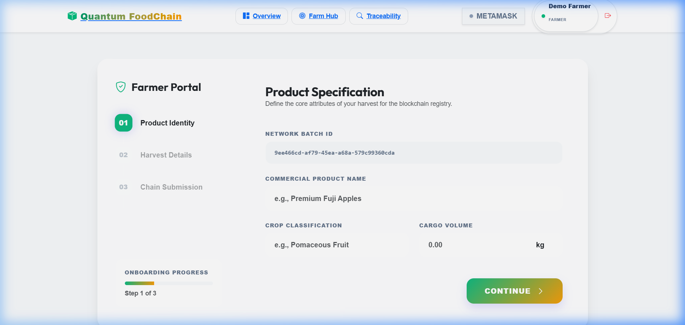

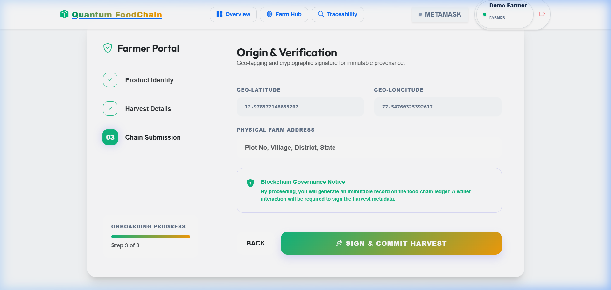

---

### 2. Processor — Quality / Processing Screen
The Processor Dashboard (Manufacturing Node) shows real-time metrics including Queue Size, In Process, Packaged items, and Quality Alerts. The Processing Form allows batch-level quality checks with IPFS certificate uploads and blockchain signing.

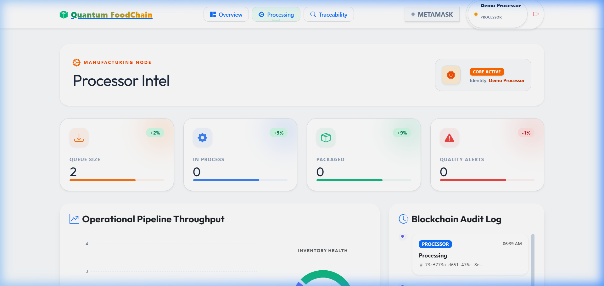

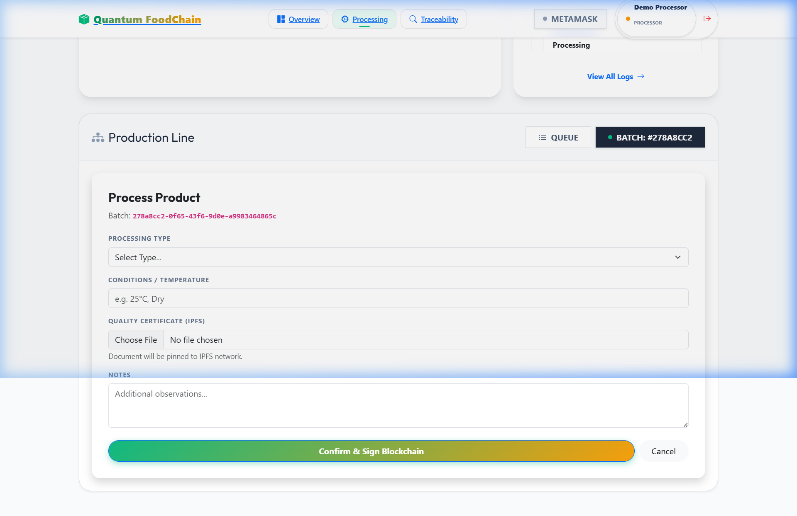

---

### 3. Distributor — Shipment Screen
The Distributor Terminal (Logistics Intelligence Node) displays Active Shipments, Queue, Delivery Rate, and Active Alerts. It supports Live Tracking with real-time cargo assignment scanning across the supply chain network.

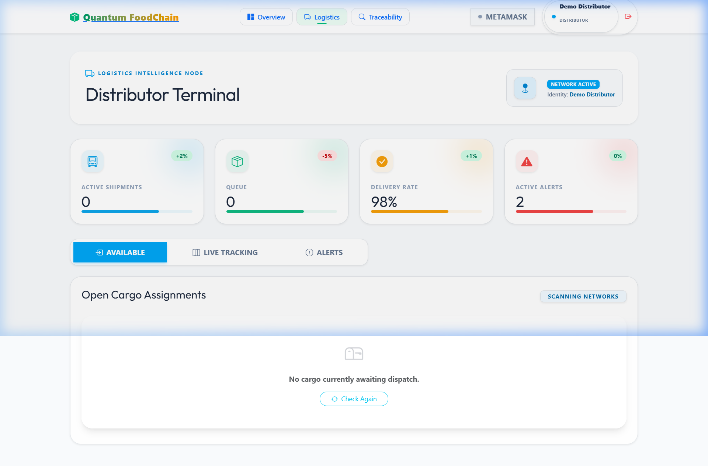

---

### 4. Retailer — Inventory / Receive Screen
The Retailer Hub (Commercial Distribution Node) shows Current Stock, Pending Arrival, Sold Items, and Active Alerts. Features Store Sales & Inventory Flow analytics and a Blockchain Audit Log for full traceability.

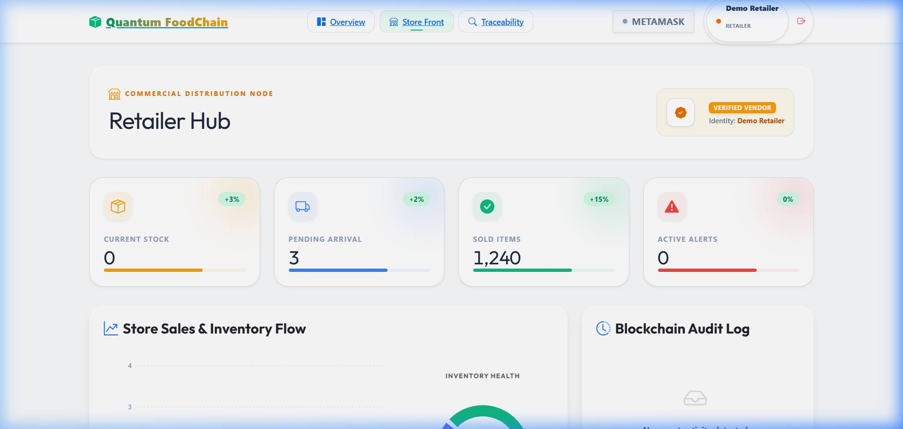

---

### 5. Consumer — Product History Page
The Consumer Traceability Portal allows users to Track Your Food by entering a Batch ID or scanning a QR code. Displays the complete blockchain-verified supply chain journey from farm to shelf.

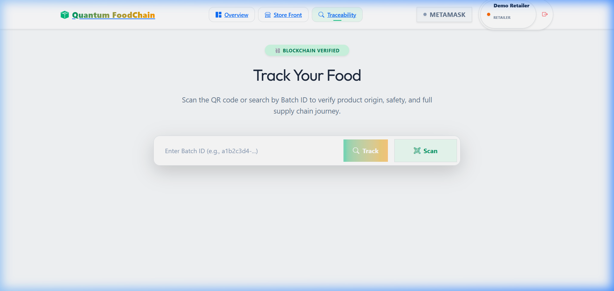

---

### 6. Hardhat Node Running
Local Ethereum blockchain node running via Hardhat with 20 pre-funded accounts (10,000 ETH each) for development and testing.

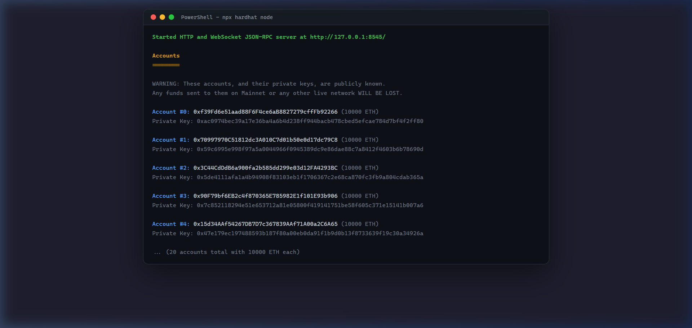

---

### 7. Smart Contract Deployed
Successful deployment of the `SupplyChain.sol` smart contract to the local Hardhat network, showing the contract address, transaction hash, and gas usage.

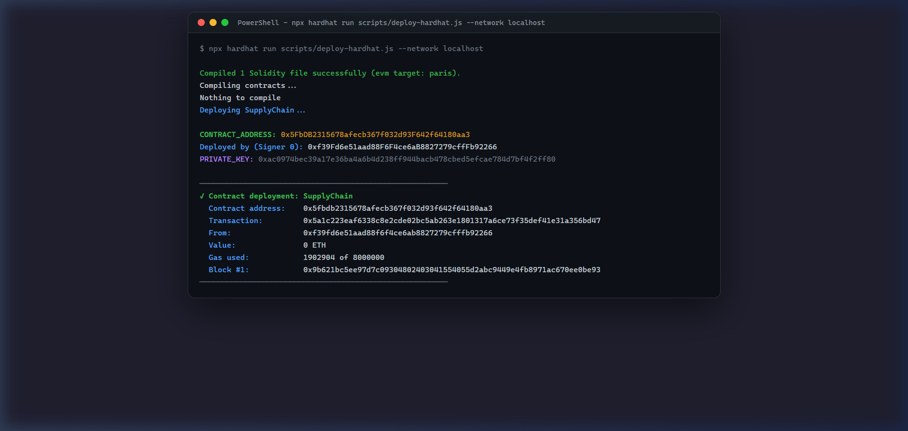

---

### 8. Backend API Running
ASP.NET Core Web API running on `http://localhost:5160` in Development mode with Swagger UI available for API testing.

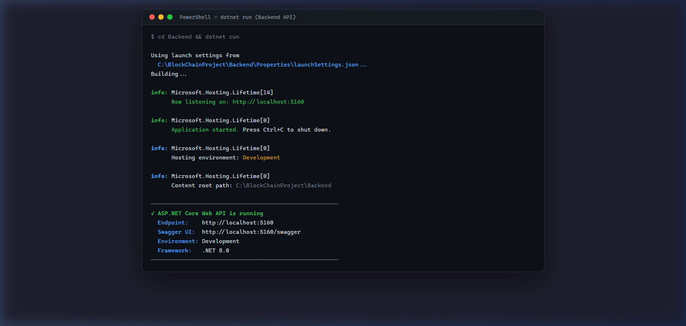

---

### 9. Login Page
The Quantum FoodChain authentication portal with role-based access control. Supports multiple roles including Admin, Farmer, Processor, Distributor, Retailer, and Consumer with demo credentials for testing.

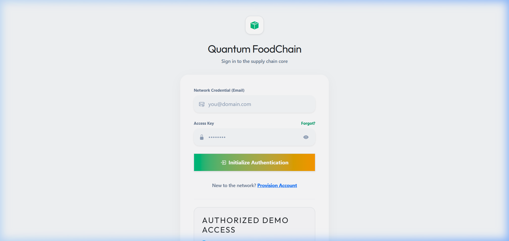

---

## Getting Started

### 1. Prerequisites
- Node.js (v16+)
- .NET 8.0 SDK
- SQL Server (LocalDB or standard)
- Ganache (for local blockchain node)
- MetaMask browser extension

### 2. Smart Contract Deployment
1. Start Ganache and ensure it's running (default port 7545).
2. Deploy the contracts:
   ```bash
   npx hardhat run scripts/deploy-ganache.cjs --network ganache
   ```
3. Update the generated contract address in your frontend configuration (`Frontend/src/services/blockchain.js` or `.env`).

### 3. Backend Setup
1. Navigate to the `Backend` directory:
   ```bash
   cd Backend
   ```
2. Update the `appsettings.json` connection string to point to your SQL Server instance.
3. Apply database migrations:
   ```bash
   dotnet ef database update
   ```
4. Run the API:
   ```bash
   dotnet run
   ```

### 4. Frontend Setup
1. Navigate to the `Frontend` directory:
   ```bash
   cd Frontend
   ```
2. Install dependencies:
   ```bash
   npm install
   ```
3. Configure your `.env` file (see `.env.example`) with the correct API URL and Smart Contract details.
4. Run the development server:
   ```bash
   npm run dev
   ```

## Workflow

1. **Farmer** logs in, registers a new crop harvest, and it gets recorded on the blockchain and SQL DB.
2. **Processor** purchases the crop and processes it into a refined product.
3. **Distributor** ships the product and updates the live location coordinates in transit.
4. **Retailer** receives the product and marks it available for sale.
5. **Consumer** scans the product QR code to view the immutable history on the blockchain.

## License
MIT License
